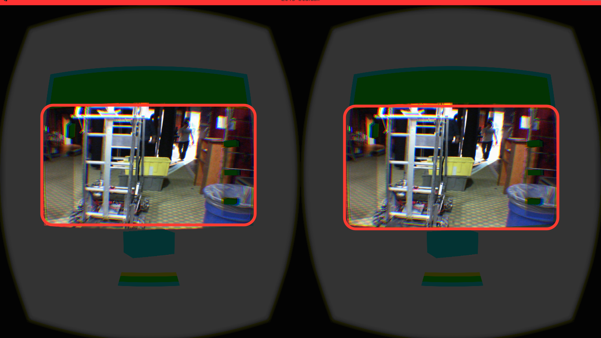
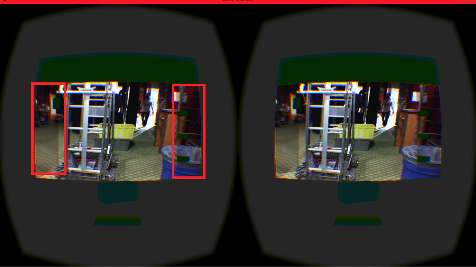
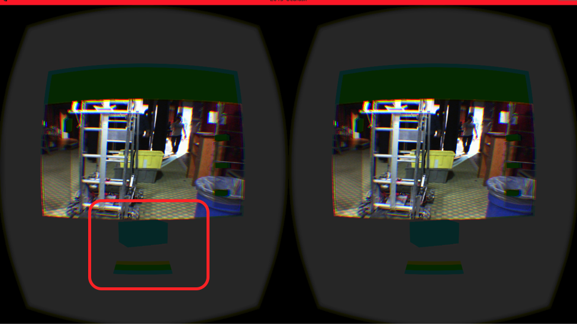
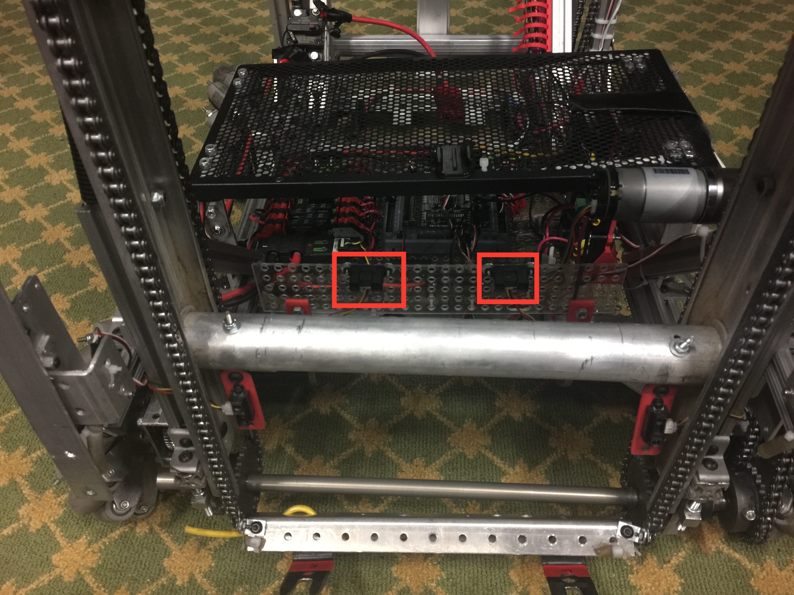
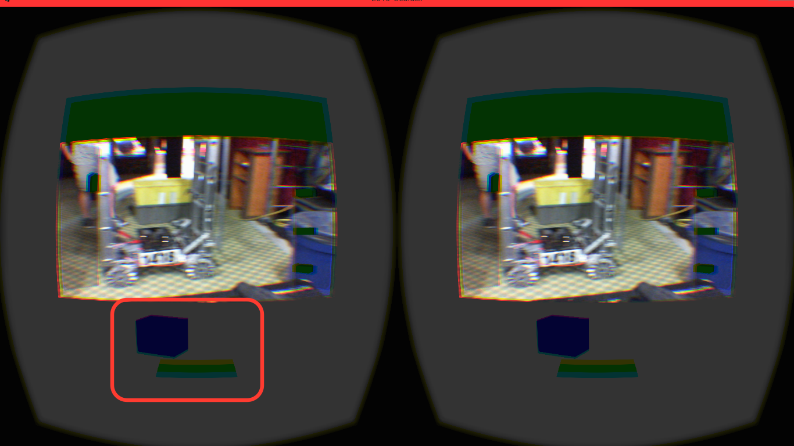
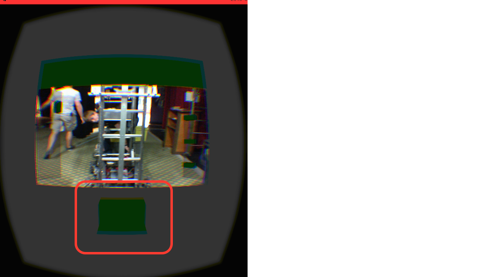

FRC1418 2015 Oculus Rift driver station interface
=================================================

* Code: [Robot](https://github.com/frc1418/2015-robot) | [UI](https://github.com/frc1418/2015-ui) | [Image Processing](https://github.com/frc1418/2015-vision) | **Oculus Rift**
* Factsheet: [Google Doc](https://docs.google.com/document/d/1irbUm-Qfxz_Ua2XiB5KzYWG2Ec5Xhr038NqL-k4FveA)
* Oculus Rift Whitepaper: [Google Doc](https://docs.google.com/document/d/1-8BB0rzydTxpMA9buoe7J2LLSpy6g8wTbeJXNPeNb_0/)

Team 1418's Oculus Rift driver station interface We're really excited
to release our Oculus Rift code for 2015!

During the build season our team came up with the idea of using the 
Oculus to help drive our robot. We all put in some money to get it.
We developed our code in a 3d game development platform called Unity
that already had very good integration with the Oculus.

Although ultimately FIRST disallowed usage of the Oculus in competition,
technologies like this have a lot of potential. We think that this type
of technology can potentially change the way that we interact with and
control our robots in the future.

**Checkout our whitepaper for pictures and video: [here](https://docs.google.com/document/d/1-8BB0rzydTxpMA9buoe7J2LLSpy6g8wTbeJXNPeNb_0/)**

Features
================

Camera mounted on the Oculus
------------

We used a 3d printer to create a mount for a camera on the front of the
Oculus. This was intended to allow the operator to see their surroundings.

Code can be seen at:

    ./Assets/StreamScreen.cs
	
Simulation of the masts on our robot
-----------------------------

This can be seen in the picture above as the green spots inside the
highlighted red. These move up and down according to our robots
position. There is only one thing on the left mast while there are
three on the right one.

This simulation was done by grabbing the encoder values from the robot.
Once we have the encoder values we compare them to the ones that have
been recorded of the top and the bottom and gives the representations
some scaled coordinates to go to.

Code for the right mast can be seen at:

    ./Assets/RobotControl/ToteForkliftControler.cs
    
Code for the Left mast can be seen at:

    ./Assets/RobotControl/CanForkliftControler.cs
	
Simulation of totes in front of robot
--------------------

This can be seen in the picture above. There is a small box that changes
angle and position based off of two distance sensors on the robot:

The tote will only show half of itself if only one of the distance sensors
is actively detecting something. This can only show position and not distance.

The tote will also turn green when two limit switches are pressed in front of
the robot.

The full math and code can be seen at:

    ./Assets/RobotControl/ToteControler.cs

Authors
=======

Students

* Carter Fendley

Dustin Spicuzza, mentor
